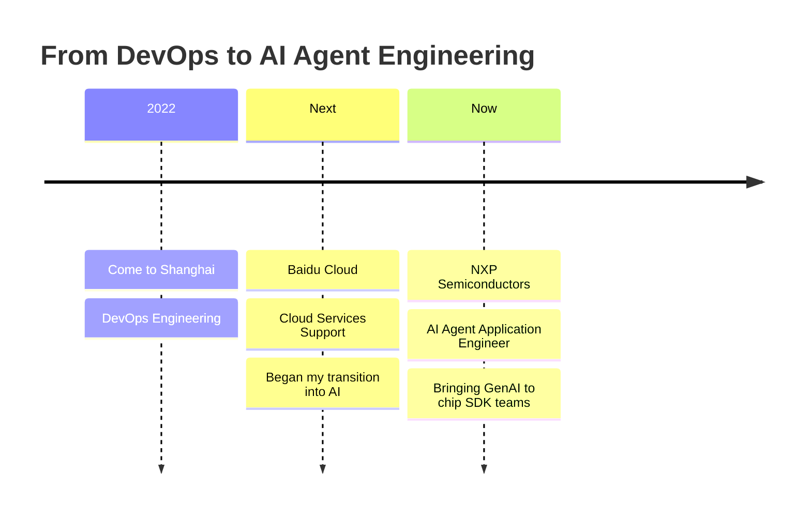
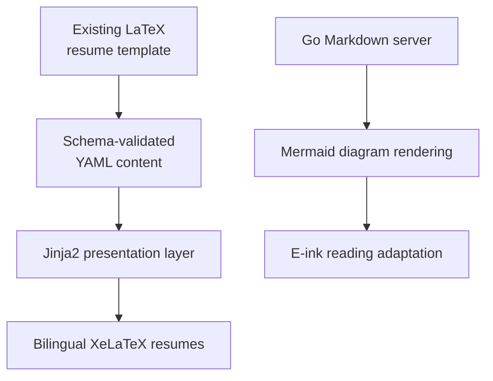

# Hi, I'm Roy Li

[](https://space.bilibili.com/776431) 
[](https://www.linkedin.com/in/roy-lee-a2a612157/) 
[](https://gou7ma7.github.io/)

Hi, I'm **Roy Li (Hongui Li)**, currently working as an  
**AI Agent Application Engineer (Contractor) at NXP Semiconductors**.

I was fortunate to catch the AI wave at the right moment. 

For nearly a decade, I have focused on improving productivity and efficiency within enterprise engineering organizations. The rise of GenAI did not change that direction; it gave me a far more powerful way to pursue it.

Today, I apply that experience within a GenAI team, turning AI from promising demos into practical engineering capabilities and bringing agentic workflows to chip SDK teams.




## How AI Changed the Way I Learn

With a respectful bow to **my AI liege**, AI has dramatically expanded the boundary of what I can explore and build as an individual engineer.

It allows me to enter an unfamiliar domain through practice instead of postponing practice until I have mastered every prerequisite. It also helps absorb much of the exhausting long tail of integration, adaptation, and customization work.

AI has not removed the need to learn. It has changed the order in which I learn:

```text
Build something useful
        ↓
Discover the real constraints
        ↓
Return to the fundamentals with concrete questions
        ↓
Understand, refine, and generalize
```

I can begin with a customized solution, observe where my understanding breaks down, and then study the underlying principles with real context. This greatly lowers the initial learning curve while making deeper study more focused and meaningful.

That same approach also shapes the tools I build:



- [**schema-driven-resume-as-code**](https://github.com/gou7ma7/schema-driven-resume-as-code)
- [**go-markdown-server-with-mermaid**](https://github.com/gou7ma7/go-markdown-server-with-mermaid)
```

---

> “It was the best of times, it was the worst of times.”
>
> I think that is especially true of the AI era—and that makes it a fascinating time to build.
